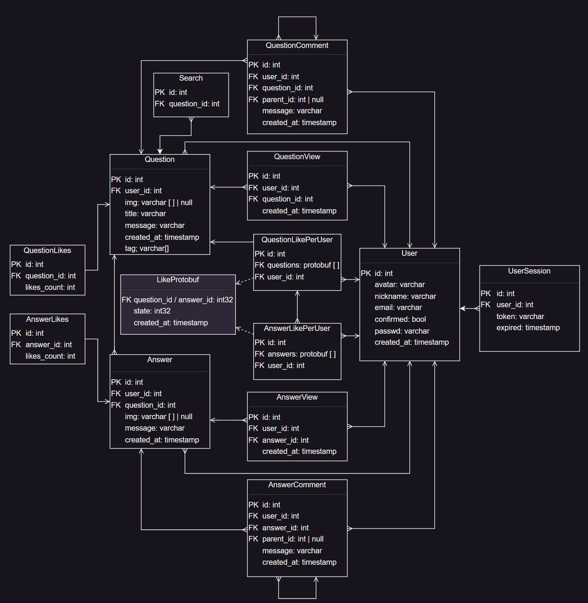

# Stack Overflow
Проектирование высоконагруженных систем - курсовая работа

## Содержание
- [Stack Overflow](#stack-overflow)
  - [Содержание](#содержание)
  - [1. Тема и целевая аудитория](#1-тема-и-целевая-аудитория)
    - [1.1 Тема](#11-тема)
    - [1.2 MVP](#12-mvp)
    - [1.3 Целевая аудитория](#13-целевая-аудитория)
  - [2. Расчет нагрузки](#2-расчет-нагрузки)
    - [2.1 Продуктовые метрики](#21-продуктовые-метрики)
    - [2.2 Технические метрики](#22-технические-метрики)
    - [2.3 Размер хранения данных](#23-размер-хранения-данных)
    - [2.4 Cетевой трафик](#24-cетевой-трафик)
    - [2.5 Прирост хранилища за год](#25-прирост-хранилища-за-год)
  - [3. Глобальная балансировка нагрузки](#3-глобальная-балансировка-нагрузки)
    - [3.1 Физическое расположение датацентров](#31-физическое-расположение-датацентров)
    - [3.2 Схема балансировки](#32-схема-балансировки)
  - [4. Локалькая балансировка нагрузки](#4-локалькая-балансировка-нагрузки)
  - [5. Логическая схема БД](#5-логическая-схема-бд)
  - [6. Физическая схема БД](#6-физическая-схема-бд)
    - [User](#user)
    - [User Session](#user-session)
    - [Question](#question)
    - [Answer](#answer)
    - [QuestionComment + AnswerComment](#questioncomment--answercomment)
    - [QuestionLike + AnswerLike](#questionlike--answerlike)
    - [QuestionView](#questionview)
    - [Media](#media)
    - [Индексы](#индексы)
    - [Репликация](#репликация)
    - [Схема развервного копирования](#схема-развервного-копирования)
    - [Клиентские библиотеки](#клиентские-библиотеки)
  - [7. Алгоритмы](#7-алгоритмы)
  - [8. Технологии](#8-технологии)
    - [Backend](#backend)
    - [Frontend](#frontend)
    - [БД и кэш](#бд-и-кэш)
    - [Хранение файлов](#хранение-файлов)
    - [Балансировка нагрузки](#балансировка-нагрузки)
    - [Брокер сообщений](#брокер-сообщений)
    - [Поиск](#поиск)
  - [9. Схема проекта](#9-схема-проекта)
  - [10. Обеспечение надежности](#10-обеспечение-надежности)
  - [11. Расчет ресурсов](#11-расчет-ресурсов)
  - [Источники](#источники)

## 1. Тема и целевая аудитория 

### 1.1 Тема 
[Stack Overflow](https://stackoverflow.com/) — система вопросов и ответов о программировании

### 1.2 MVP

- Регистрация / Авторизация
- Теги вопросов
- Создание вопроса
- Добавление ответа
- Комментирование ответов и вопросов
- Оценка (лайки и дизлайки)
- Картинки

### 1.3 Целевая аудитория 

Посещений в месяц - 100 млн

| Страна            | Процент пользователей |
| ----------------- | --------------------- |
| Соединенные Штаты | 20.31%                |
| Индия             | 9.57%                 |
| Великобритания    | 3.50%                 |
| Германия          | 3.29%                 |
| Другие            | 59.33%                |

## 2. Расчет нагрузки 

### 2.1 Продуктовые метрики 

Данные взяты с StackOverflow[[1]](https://stackoverflow.com/) и SignHouse[[2]](https://www.usesignhouse.com/blog/stack-overflow-stats)

- В среднем один вопрос или один ответ имеют размер 1000 символов - 1 КБ
- В среднем один вопрос или один ответ оценивают 50 раз
- В среднем один вопрос или один ответ комментируют 2 раза, комментарий в среднем занимает 0.25 КБ
- Картинки встречаются редко, поэтому примем 1 картинку на 50 вопросов и ответов, картинка в среднем занимает 0.5 МБ

| Метрика                               | Показатель |
| ------------------------------------- | ---------- |
| Зарегистрированных пользователей      | 23 млн     |
| Посещений в месяц                     | 100 млн    |
| Посещений в день                      | 8.8 млн    |
| Средняя продолжительность посещения   | 7:21 мин   |
| Среднее количество посещенных страниц | 2.47       |
| Количество вопросов                   | 23 млн     |
| Количество вопросов в минуту          | 4          |
| Вопросы / Ответы                      | 0.67       |
| Количество ответов в минуту           | 6          |
| Количество ответов                    | 34 млн     |
| Количество комментариев               | 114 млн    |
| Количество оценок                     | 2'850 млн  |
| Количество картинок                   | 1.15 млн   |

### 2.2 Технические метрики

- Создание вопроса: 4 / 60 = 0.066 RPS
- Добавление ответа: 6 / 60 = 0.1 RPS
- Добавление комментариев(2 на один вопрос и ответ): (4 + 6) * 2 / 60 = 0.33
- Лайки и дизлайки(50 на один вопрос и ответ): (4 + 6) * 50 / 60 = 8.33 RPS
- Картинки(1 на 50 вопросов и ответов): (4 + 6) / 50 / 60 = 0.0033 RPS
- Просмотр страниц с вопросами: 
  - учитываем RPS от просмотра страницы с созданным вопросом
  - учитываем RPS от просмотра страницы с добавленным ответом
  - 8.8 * 106 * 2.47 / (24 * 60 * 60) + 0.066 + 0.1 = 252 RPS

Точный коэффициент в пике найти не удалось, поэтому примем его равным 1.7

| Тип нагрузки           | Средний RPS | Пиковый RPS |
| ---------------------- | ----------- | ----------- |
| Просмотр вопросов      | 252         | 428.4       |
| Добавление оценки      | 8.33        | 14.16       |
| Добавление комментария | 0.33        | 0.561       |
| Добавление ответа      | 0.1         | 0.17        |
| Создание вопроса       | 0.066       | 0.112       |
| Добавление картинки    | 0.0033      | 0.00561     |

### 2.3 Размер хранения данных

- Объем хранения вопросов: 23 млн КБ = 21.93 ГБ
- Объем хранения ответов: 34 млн КБ = 32.42 ГБ
- Объем хранения ответов: (23 + 34) * 106 * 0.25 КБ = 14'250'000 КБ = 13.59 ГБ
- Объем хранения картинок: (23 + 34) * 106 / 50 * 0.5 МБ = 570'000 МБ = 556.64 ГБ
- Объем хранения оценок: 2'850 * 106 * 12 Б = 31.85 ГБ 

### 2.4 Cетевой трафик

- RPS = 252
- Трафик вопросов: 
  - 1 - колество вопросов на 1 RPS
  - 1 КБ * 8 = 8 Кбит - размер одного вопроса
  - RPS * 1 * 8 Кбит = 2'016 Кбит/с = 2 Мбит/с
- Трафик ответов: 
  - 1 / 0.67 = 1.5 - количество вопросов на 1 RPS
  - 1 КБ * 8 = 8 Кбит - размер одного ответа
  - RPS * 1.5 * 8 Кбит = 3'024 Кбит/с = 3 Мбит/с
- Трафик комментариев: 
  - (1 + 1.5) * 2 = 5 - колество комментариев на 1 RPS <(вопрос + ответ) * комментариев_на_вопрос_и_ответ>
  - 0.25 КБ * 8 = 2 Кбит - размер одного комментария
  - RPS * 5 * 2 Кбит = 2'520 Кбит/с = 2.5 Мбит/с
- Трафик картинок: 
  - (1 + 1.5) * (1 / 50) = 0.05 - количество картинок на 1 RPS <(вопрос + ответ) * картинок_на_вопрос_и_ответ>
  - 0.5 МБ * 8 = 4 Мбит - размер одной картинки
  - RPS * 0.05 * 4 Мбит = 50.4 Мбит/с
- Трафик оценок: 
  - (1 + 1.5) * 50 = 125 - количество оценок на 1 RPS <(вопрос + ответ) * оценок_на_вопрос_и_ответ>
  - 12 Б * 8 = 96 бит - размер одной оценки
  - RPS * 125 * 96 Б = 2'953 Кбит/с = 3 Мбит/с
- Трафик статики страницы(html + css + js + img): RPS * (40 КБ + (85 + 58 + 5) КБ + (34 + 26 + 19 + 90 + 21 + 81 + 5 + 58) КБ + 400 КБ) * 8 = 1'858'752 Кбит/с = 1'815 Мбит/с
- Трафик создания вопроса:
  - 1 КБ * 8 = 8 Кбит - размер одного вопроса
  - 0.066 * 8 Кбит = 0.528 Кбит/с = 0.5 Мбит/с
- Трафик добавления ответа:
  - 1 КБ * 8 = 8 Кбит - размер одного ответа
  - 0.1 * 8 Кбит = 0.8 Кбит/с = 0.8 Мбит/с
- Трафик добавления комментария:
  - 0.25 КБ * 8 = 2 Кбит - размер одного комментария
  - 0.33 * 2 Кбит = 0.7 Кбит/с = 0.7 Мбит/с
- Трафик добавления оценки:
  - 12 Б * 8 = 96 бит - размер одной оценки
  - 8.33 * 96 бит = 0.8 Кбит = 0.8 Мбит/с
- Трафик добавления картинки:
  - 12 Б * 8 = 96 бит - размер одной оценки
  - 0.5 МБ * 8 = 4 Мбит - размер одной картинки
  - 0.0033 * 4 Мбит = 0.015 Мбит/с

**Таблиц с выходящим трафиком**
| Тип данных  | Средний трафик, Мбит/с | Пиковый трафик, Мбит/с |
| ----------- | ---------------------- | ---------------------- |
| Вопросы     | 2                      | 3.4                    |
| Ответы      | 3                      | 5.1                    |
| Комментарии | 2.5                    | 4.25                   |
| Картинки    | 50.4                   | 85.68                  |
| Оценки      | 3                      | 5.1                    |
| Статика     | 1'815                  | 3'085.5                |

**Таблиц с входящим трафиком**
| Тип данных  | Средний трафик, Мбит/с | Пиковый трафик, Мбит/с |
| ----------- | ---------------------- | ---------------------- |
| Вопросы     | 0.5                    | 0.85                   |
| Ответы      | 0.8                    | 1.36                   |
| Комментарии | 0.7                    | 1.19                   |
| Оценки      | 0.8                    | 1.36                   |
| Картинки    | 0.015                  | 0.0255                 |

### 2.5 Прирост хранилища за год

Коэфициент RPS -> RPY = 60 * 60 * 24 * 365 = 31'536'000

- Вопросы: 0.066 * 31'536'000 * 1 КБ = 2'081'376 КБ/год = 2'032.6 МБ/год = 2 ГБ/год 
- Ответы: 0.1 * 31'536'000 * 1 КБ = 3'153'600 КБ/год = 3'079.7 МБ/год = 3 ГБ/год 
- Комментарии: 0.33 * 31'536'000 * 0.25 КБ = 2'601'720 КБ/год = 2'540.8 МБ/год = 2.5 ГБ/год 
- Оценки: 8.33 * 31'536'000 * 12 Б = 3'078'456 КБ/год = 3'006.3 МБ/год = 3 ГБ/год 
- Картинки: 0.0033 * 31'536'000 * 0.5 МБ/год = 52'034.4 МБ/год = 50 ГБ/год 

| Тип данных  | ГБ/год |
| ----------- | ------ |
| Вопросы     | 2      |
| Ответы      | 3      |
| Комментарии | 2.5    |
| Оценки      | 3      |
| Картинки    | 50     |

## 3. Глобальная балансировка нагрузки

### 3.1 Физическое расположение датацентров
- Северная Америка - 2 ДЦ (в Соединенных Штатах)
  - В Пенсильвании (в ближайшем радисе живет большая часть населения страны)
  - В Калифорнии
- Европа - 1 ДЦ (Германия)
- Азия - 1 ДЦ (Индия)
- Австралия - 1 ДЦ

### 3.2 Схема балансировки
- Определяем регион через Geo-based DNS
- В регионе определяем ближайший ДЦ через BGP Anycast

## 4. Локалькая балансировка нагрузки
1. В каждом датацентрле будет один L7 балансировщик - nginx. (Возможно стоит ставить второй запасной и для BGP запасному задавать меньший вес для отказоустойчивости [[Статья на хабре]](https://habr.com/ru/companies/vk/articles/347026/))
2. nginx проксирует запросы на бэкенды

Есть два варианта оптимизации, которые как мне кажется все усложнят и увеличат стоимость, но дадут какой то прирост
- Прямой возврат с сервера (DSR)
- Добавить промежуточные машины с nginx (или на машины с бэкендом, но это усложняет развертывание), для уменьшения нагрузки от TLS. На основой через stream перенаправляем на промежуточные 
  
Возможно стоит поменять nginx на envoy(c возможностями envoy не очень хорошо знаком лично). Есть небольшая таблица стравнения nginx, envoy и других [[Статья на хабре]](https://habr.com/ru/articles/482578/)
 

## 5. Логическая схема БД

## 6. Физическая схема БД
Для хранения данных будем использовать PostgreSQL (за исключением таблиц, где не сказано обратное). Это популярная БД, которая хорошо масштабируется и имеет большое сообщество, соответственно проще поддерживат и имеет высокую надежность. Также есть возможность использовать репликацию и шардирование.

### User
| Столбец    | Тип          | Размер |
| ---------- | ------------ | ------ |
| id         | int          | 4 Б    |
| avatar     | varchar(256) | 256 Б  |
| nickname   | varchar(256) | 256 Б  |
| email      | varchar(256) | 256 Б  |
| confirmed  | boolean      | 1 Б    |
| passwd     | varchar(256) | 256 Б  |
| created_at | timestamp    | 4 Б    |

Всего 23 млн зарегистрированных пользователей

Размер таблицы: 23 * 106 * (4 + 256 + 256 + 256 + 1 + 256 + 4) Б = 23 * 106 * 777 Б = 17'871'000'000 Б = 17.87 ГБ

### User Session
| Столбец    | Тип          | Размер |
| ---------- | ------------ | ------ |
| id         | int          | 4 Б    |
| user_id    | int          | 4 Б    |
| token      | varchar(256) | 256 Б  |
| expired    | timestamp    | 4 Б    |

Для хранения сессий будем использовать Redis, так как он быстрее и проще в использовании, чем PostgreSQL. Данная БД хранит данные в оперативной памяти, обладает высокой производительностью, поэтому не подходит для хранения больших объемов данных, но для хранения сессий подходит идеально.

Размер таблицы: 23 * 106 * (4 + 4 + 256 + 4) Б = 23 * 106 * 268 Б = 6'164'000'000 Б = 6.16 ГБ

### Question
| Столбец     | Тип             | Размер    |
| ----------- | --------------  | --------- |
| id          | int             | 4 Б       |
| user_id     | int             | 4 Б       |
| title       | varchar(256)    | 256 Б     |
| message     | varchar(8192)   | 8192 Б    |
| img         | varchar(256)[N] | N * 256 Б |
| created_at  | timestamp       | 4 Б       |
| likes_count | int             | 4 Б       |

Всего 23 млн вопросов

Размер таблицы: 23 * 106 * (4 + 4 + 256 + 8192 + 256 + 4 + 4) Б = 23 * 106 * 8'768 Б = 202'064'000'000 Б = 202.06 ГБ

Шардирование по **user_id**

### Answer
| Столбец     | Тип             | Размер    |
| ----------- | --------------- | --------- |
| id          | int             | 4 Б       |
| user_id     | int             | 4 Б       |
| question_id | int             | 4 Б       |
| message     | varchar(8192)   | 8192 Б    |
| img         | varchar(256)[N] | N * 256 Б |
| created_at  | timestamp       | 4 Б       |
| likes_count | int             | 4 Б       |

Всего 34 млн ответов

Размер таблицы: 34 * 106 * (4 + 4 + 4 + 8192 + 256 + 4 + 4) Б = 34 * 106 * 8'768 Б = 298'112'000'000 Б = 298.11 ГБ

Шардирование по **question_id**

### QuestionComment + AnswerComment
| Столбец                 | Тип           | Размер |
| ----------------------- | ------------- | ------ |
| id                      | int           | 4 Б    |
| user_id                 | int           | 4 Б    |
| question_id / answer_id | int           | 4 Б    |
| parent_id               | int           | 4 Б    |
| message                 | varchar(512)  | 512 Б  |
| created_at              | timestamp     | 4 Б    |

Всего 114 млн комментариев

Размер таблицы: 114 * 106 * (4 + 4 + 4 + 4 + 512 + 4) Б = 114 * 106 * 536 Б = 61'104'000'000 Б = 61.1 ГБ

### QuestionLike + AnswerLike
| Столбец                 | Тип           | Размер |
| ----------------------- | ------------- | ------ |
| id                      | int           | 4 Б    |
| user_id                 | int           | 4 Б    |
| question_id / answer_id | int           | 4 Б    |
| created_at              | timestamp     | 4 Б    |
| state                   | int           | 4 Б    |

Всего 2'850 млн оценок

Размер таблицы: 2'850 * 106 * (4 + 4 + 4 + 4 + 4) Б = 2'850 * 106 * 20 Б = 57'000'000'000 Б = 57 ГБ

Лайки есть только у зарегестрированных пользователей. Хранить будем в ClickHouse. ClickHouse является колоночной БД и хорошо подходит для аналитики, так как быстро обрабатывает большие объемы данных.

### QuestionView
| Столбец     | Тип           | Размер  |
| ----------- | ------------- | ------- |
| id          | int           | 4 Б     |
| user_id     | int           | 4 Б     |
| question_id | int[N]        | N * 4 Б |
| created_at  | timestamp     | 4 Б     |

Историю просмотров будем хранить только для зарегистрированных пользователей в ClickHouse. 

Размер данных за два месяца: 23 * 106 * (4 + 4 + 4 * 2.47 * 60 * 2 + 4) Б = 23 * 106 * 1'178'400 Б = 27'115'200'000 Б = 27.12 ГБ

### Media

Для картинок будет использоваться S3. Это хранилище от Amazon, которое хорошо масштабируется и имеет высокую надежность.

### Индексы
| Таблица  | Поле        |
| -------- | ----------- |
| User     | id          |
| Question | user_id     |
| Answer   | question_id |
| Session  | token       |

### Репликация
| Таблица  | Тип          |
| -------  | ------------ |
| User     | master-slave |
| Question | master-slave |
| Answer   | master-slave |
| Comment  | master-slave |

### Схема развервного копирования

Для всех таблиц можно делать снапшот раз в день

### Клиентские библиотеки
Приложение будет написано на userver(C++ Async Framework) от yandex, в который входят драйвера для PostgreSQL, Redis, ClickHouse.

## 7. Алгоритмы
Добавление системы обраной связи (отправки жалоб).
Некоторые вопросы, ответы или комментарии могут содержать запрещенный контент или оскорблять других пользователей.
После получения жалобы модераторы проверят контент.

На основе просмотренных вопросов на главной странице можно предлагать пользователю (зарегестрированному) вопросы, которые ему могут быть интересны. 
Так же стоит выдавать вопросы тематик, которые пользователь раньше не смотрел, но выдавать их ниже в списке. 
Для не зарегестрированных пользователей будем выдавать вопросы отсортированные по дате создания.

На странице вопроса можно предлагать пользователю похожие вопросы. 
Можно дабавить такое понятие как "теги вопроса", для уменьшения области поиска.
Будем использовать NLS, который основан на преобразовании текста в вектор.
Получится быстрый поиск вопросов с похожим содержанием. 

Поиск вопросов можно производить на сайте, а не только через google.
Для поиска можно использовать Elasticsearch. 
Он позволяет использовать полнотекстовый поиск по документам.
Elasticsearch обладает хорошей найдежностью и отказоустойчивостью.

## 8. Технологии

### Backend
C++ (userver) - опенсорс фреймворк для написания бэкенда. Он быстрый и имеет высокую производительность. Также в нем есть драйвера для PostgreSQL, Redis, ClickHouse. Так же из коробки поддерживается gRPC, что позволяет легко добавить микросервисы. Фреймворк является асинхронным, а код пишется в синхронном стиле, что упрощает разработку.

### Frontend
React (typescript) - Библиотека для написания фронтенда(SPA). Она позволяет легко создавать интерактивные пользовательские интерфейсы. Также в ней есть поддержка SSR (nextjs), что позволяет ускорить загрузку страницы. Также в ней есть поддержка PWA, что позволяет добавить приложение на главный экран телефона.

### БД и кэш
PostgreSQL - БД для хранения данных. Она хорошо масштабируется и имеет высокую надежность. 

ClickHouse - БД для хранения аналитических данных. Она хорошо масштабируется и имеет высокую надежность. 

Redis - БД для хранения сессий. Она хорошо масштабируется и имеет высокую производительность.

Кэшированание можно реализовать с помощью Redis. Nginx может кэшировать статику. 

### Хранение файлов
S3 - Хранилище для хранения файлов. Оно хорошо масштабируется и имеет высокую надежность.

### Балансировка нагрузки
Nginx - Балансировщик нагрузки. Показывает хорошую производительность при большом количестве запросов.

### Брокер сообщений
Apache Kafka - Брокер сообщений. Имеет большую пропускную способность. Поддерживает масштабирование. Имеет высокую оказоустойчивость. 

### Поиск
Elasticsearch - Поисковый движок. Позволяет использовать полнотекстовый поиск по документам. Обладает хорошей найдежностью и отказоустойчивостью.

## 9. Схема проекта 

## 10. Обеспечение надежности

- Резервирование датацентров
- Резервирование БД
- RAID 10
- CQRS (Command Query Responsibility Segregation)
- Баласировщик нагрузки (nginx)
  - Health Check
  - upstream
- Сегментирование
  - Важные
    - Auth
    - Question
    - Answer
    - Search
    - User
  - Неважные 
    - Comments
    - Views
    - Likes
    - Statistic (View)
- Failover policy (Ретраи)
- Graceful degradation (Для не важных компонентов из сегментирования)
- Резервирование логики (Search)

## 11. Расчет ресурсов

| Сервис       | Целевая пиковая нагрузка, RPS | CPU | RAM    | Net         |
| ------------ | ----------------------------- | --- | ------ | ----------- |
| Auth         | 10000                         | 100 | 32 Gb  | 10 Gbit/s   |
| Search       | 250                           | 25  | 4 Gb   | 1 Gbit/s    |
| User         | 500                           | 5   | 1 Gb   | 0.5 Gbit/s  |
| UploadImg    | 1                             | 1   | 0.5 Gb | 0.5 Gbit/s  |
| Question     | 500                           | 5   | 1 Gb   | 0.25 Gbit/s |
| Answer       | 1000                          | 10  | 2 Gb   | 0.5 Gbit/s  |
| Comments     | 1500                          | 15  | 3 Gb   | 0.25 Gbit/s |
| Likes        | 1500                          | 15  | 2 Gb   | 0.25 Gbit/s |
| Views        | 1500                          | 15  | 2 Gb   | 0.25 Gbit/s |
| Statistic    | 200                           | 2   | 0.5 Gb | 0.25 Gbit/s |
| Create       | 100                           | 5   | 2 Gb   | 0.25 Gbit/s |
| CreateSearch | 100                           | 5   | 2 Gb   | 0.25 Gbit/s |
| nginx        | 15000                         | 50  | 32 Gb  | 10 Gbit/s   |

| Сервис | Хостинг | Конфигурация                       | Cores | Cnt     | Покупка | Аренда/Амортизация |
| ------ | ------- | ---------------------------------- | ----- | ------- | ------- | ------------------ |
| nginx  | own     | 2x6430/4x8GB/1xNVMe256Gb/2x10Gb/s  | 64    | 2       | $10'000 | $167               |
| Auth   | own     | 2x6430/4x8GB/1xNVMe256Gb/2x10Gb/s  | 64    | 1       | $10'000 | $132               |
| other  | own     | 1x6434/4x4GB/1xNVMe256Gb/2x1Gb/s  | 8     | 18      | $6'000  | $80                |

## Источники 

1. https://stackoverflow.com/
2. https://www.usesignhouse.com/blog/stack-overflow-stats
3. https://habr.com/ru/companies/vk/articles/347026/